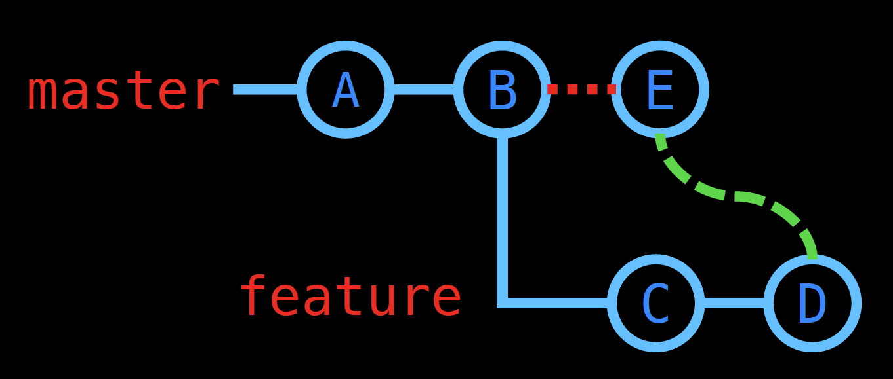

# Introduction to Git Part 1

Use the commands below to create a basic Git tree and learn how to use commands such as `init`, `status`, `add`, `commit`, `log`, `checkout` and `merge`. The goal is to create a git tree that models the following diagram:



In depth write up coming soon!

```bash
# Create working directory
mkdir GitWorkshop
cd GitWorkshop

# initialize git repo
git init

# create first file
echo "# Intro to Git Workshop" >> README.md

# Display information about current repo
git status

# Add file to staging and commit to active branch (master)
git add README.md
git commit -m 'Add readme file'

# Edit the file
# Tip: exit Vim by using the ESC key and then typing `:wq`
vi README.md

# Display info, create second commit
git status
git add README.md
git commit -m 'Edit readme file'

# Create and swap to a new branch
git checkout -b feature/add-new-file

# Create a new file
echo "# New File" >> NewFile.md

# Create a commit on the new branch for the new file
git status
git add NewFile.md
git commit -m 'Add new file'

# Display more detailed information about your commits
# Use the 'q' key to exit
git log

# Edit the file and commit it to the active feature branch (feature/add-new-file)
vi NewFile.md
git add NewFile.md
git commit -m 'Edit new file'

# Swap to master branch
git checkout master

# Merge the feature branch onto master and create a merge commit
git merge --no-ff feature/add-new-file

# Look how the commit tree now resembles the original tree diagram
git log --graph --oneline --all

# Good work! You've completed workshop part 1
```