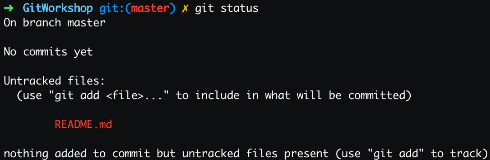
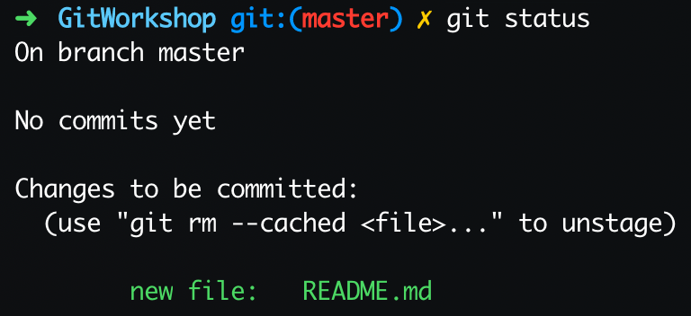
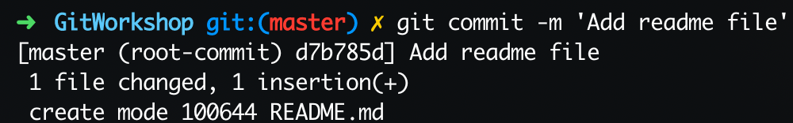
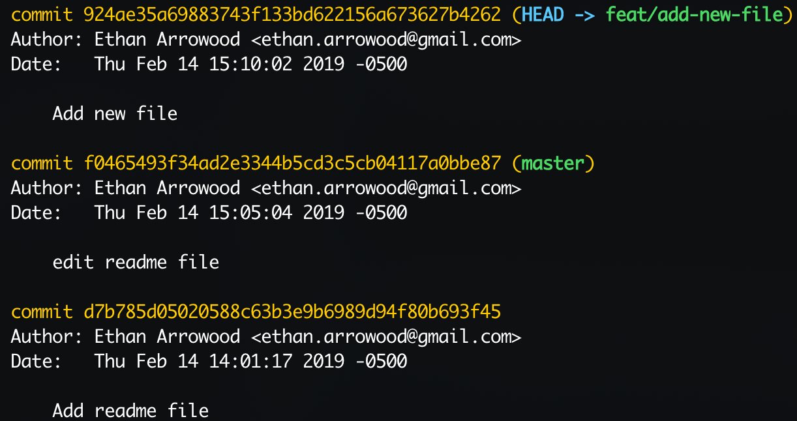
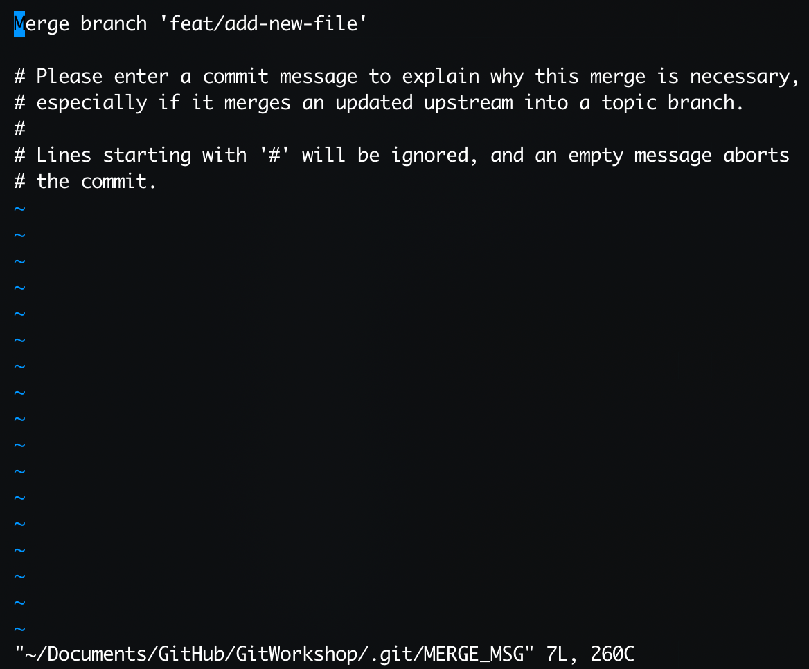
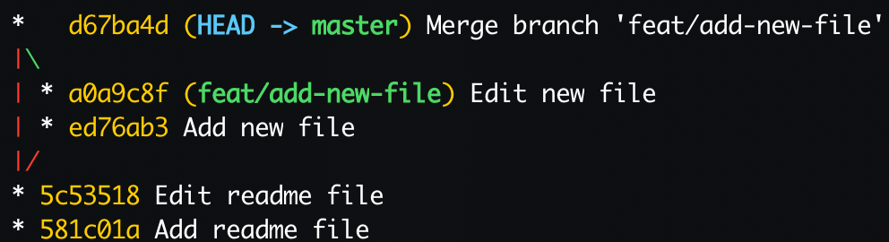

# Introduction to Git Part 1

Welcome! This workshop will cover the absolute basics of using **Git**. Everything can be done through the command line. It will introduce the following commands: `init`, `status`, `add`, `commit`, `log`, `checkout` and `merge`. The final goal is to create a git tree that models the following diagram:


This workshop was originally presented live to students at Wentworth Institute of Technology. A video is currently a work-in-progress.

Before starting, download and install **Git** onto your machine

## Table of Contents
- [First Steps](#first-steps)
  - [Git init](#git-init)
  - [Git status & add](#git-status-&-add)
  - [Git commit](#git-commit)
- [Quick Practice](#quick-practice)
- [Branching](#branching)
  - [Git checkout](#git-checkout)
  - [Git log](#git-log)
- [Merging](#merging)
  - [Git merge](#git-merge)
- [Conclusion](#conclusion)

## First Steps

> Commands introduced in this section include: `init`, `status`, `add`, `commit`

There are multiple ways to initialize a **git** project. Lets focus on the most simple method--using the `init` command on an empty directory. If you are on Windows I recommend launching the **Git Bash** application (it should have been installed when you first installed **Git**). If you are on Mac or Linux use whatever terminal application you are most comfortable with.

### Git init
Create the workshop directory and change your terminals working directory to the new directory. Then, initialize the new git repository using the `init` command. This command creates a hidden `.git` folder and enables **Git** to track directory changes.

```bash
# Create working directory
# 'mkdir' stands for 'make directory'
# 'cd' stands for 'change directory'
mkdir GitWorkshop
cd GitWorkshop

# initialize git repo
git init
```

Now lets add our first file to the project. For simplicity sake, the files in this workshop will all be markdown. All of the commands and operations discussed will work on practically _any_ file type especially code-based files such as `.html`, `.java`, `.cpp`, and many more! Below, I demonstrate how to use the `echo` bash command to write a message to a file. There are many ways to create and edit files, do whatever is easiest for you.

```bash
# create first file
echo "# Intro to Git Workshop" >> README.md
```

### Git status & add

The new file is now ready to be tracked by **Git**. You need to explicitly tell **Git** to track your files. You can also tell **Git** to ignore files, but we will save that for a future workshop. Before we tell **Git** to track the new file lets run a new command, `status`.

```bash
# Display information about current repo
git status
```
The output from this command will be:



The first line tells us the current active branch. We will learn more about the term "branch" shortly.

The second line shows how many commits currently exist. We haven't created our first commit yet, so "no commits yet" is expected.

Finally, the last section of text starts with the words "Untracked files:". I previously mentioned that we need to explicitly tell **Git** to track our files. We do so using the `add` command.

```bash
# Add file to staging
git add README.md
```
The new file is now being tracked by **Git**. Run `git status` again and you'll see a new output:



The README.md file is now considered to be _staged_. In the context of **Git** the word 'stage' refers to new, tracked file changes that have **not** been committed yet. The next section describes what it means to 'commit changes'. Lastly, in the screenshot above, notice **Git's** use of the word 'unstage'. If you added a file to staging and want to remove it (without losing its changes) you can use the `rm` command; however, we will not be demonstrating that functionality in this workshop.

### Git commit

The new file, README.md, is staged and ready to be commited to the active branch _master_. To commit something is to create a _commit_ object and add it to the **Git** tree. Commit objects contain information regarding file changes. **Git** uses this information for a variety of things, but most importantly allows you the developer to visualize the change in your code over time. In a future workshop we will dive deeper into commit objects and explore some of their most common use cases.

Commit the new file and write a short (72 characters or less) description about the changes introduced with this commit object.
```bash
# Commit staged files to active branch (master)
git commit -m 'Add readme file'
```
The `-m` flag stands for "message" and the following text (wrapped in single or double quotes) is the message itself.

Something similar to the following should be output to your console:



You have succesfully created your first commit on the master branch. Lets quickly breakdown this console output before moving on; it is full of really important information!

To start, lets disect the first line:

> [master (root-commit) d7b785d] Add readme file

It contains the branch name "master". It indicates that it is the "root-commit"; this means it is the first commit of your project. It contains the commit **hash**. A commit hash is a randomly generated string of text that is used to uniquely identify the commit object. Your hash is most likely different from mine! Finally, the last bit of text is the commit message we passed to the `commit` command's `-m` flag.

Next, the second line:

> 1 file changed, 1 insterion(+)

This is a short more technical description of the changes introduced in the commit. By adding the new file to the project **Git** considers this _1 file change_. And because we added new data (instead of deleting data), **Git** considers this change an _insertion_.

Finally, the third and last line:

> create mode 100644 README.md

This contains some very low-level information regarding the new file. The first two words, 'create mode' indicates that the new file is new; other modes include 'edit' and 'delete'. The number sequence, '100644' refers to the type of data as well as operating system permissions. See [this](https://stackoverflow.com/questions/737673/how-to-read-the-mode-field-of-git-ls-trees-output/8347325#8347325) StackOverFlow question for more information if you're interested. And the last bit of text is of course the file name descriptor.

🎉 Congrats! You've completed a lot thus far. A quick recap:
- `init` command initializes a repository
- `status` shows information regarding the staging environment
- `add` adds a file to staging
- `commit` creates a commit object for the file changes in staging

## Quick Practice

Before I introduce new concepts lets practice using the commands we just learned. Start by modifying the README.md file. Use any method you'd like; I'll be using Vim.

```bash
# Edit the file
# Tip: exit Vim by using the ESC key and then typing `:wq`
vi README.md
```
When Vim launches, press the 'I' key to enter _insert_ mode. Use your arrow keys to move your cursor and make any change you'd like. I am adding a line to my README.md file. When you're done editing hit 'ESC', then type ':wq', and hit 'ENTER' to write your changes and quit Vim.

Now create a new commit documenting your file changes. Refer back to [First Steps](#first-steps) for in depth descriptions of these commands.

```bash
# Display info, create second commit
git status
git add README.md
git commit -m 'Edit readme file'
```
Good work; you now have 2 commits on master. If you refer back to the Git tree image these would be the 'A' and 'B' circles.

## Branching

> Commands introduced in this section include: `checkout` and `log`

Until now we have been working on the _master_ branch. This is the default main branch for any **Git** project. When developing a project with **Git** it is best practice to utilize branches in order to work on new things. Some specific examples include adding new features, fixing bugs, or updating/removing old code. In fact, some open source projects actually prohibit development on the master branch so this is an important thing to learn.

### Git checkout
Lets start by creating a new branch using the `checkout` command. 
```bash
# Create and swap to a new branch
git checkout -b feat/add-new-file
```
The `checkout` command is very versatile. By using the `-b` flag we can create a new branch and swap over to it all in one command. The new branch name is 'feat/add-new-file'. You can call a branch anything you want, but I recommend being as descriptive as possible. I commonly prepend my branch names with 'feat/' or 'fix/' to indicate if the change is a feature or a fix. **Git** is meant to be a organizational tool; use it to keep your project well organized. The best way to do so is to always be as descriptive as possible (in reason).

This operation can be extrapolated into two seperate commands but for beginners I recommend using the `checkout` command only.

Next, create a new file and create a new commit.
```bash
# Create a new file
echo "# New File" >> NewFile.md

# Create a commit on the new branch for the new file
git status
git add NewFile.md
git commit -m 'Add new file'
```
If you refer back to the Git Tree image, this commit would be in reference to the 'C' node.

### Git log

When I first introduce the `commit` command I explained how every commit is assigned a random hash that is used to uniquely identify it from other commits. I also explained how it is important to write a descriptive commit message. Using the `log` command we can see why these things are important
```bash
# Display more detailed information about your commits
# Use the 'q' key to exit
git log
```
The output of the `log` command should be similar to the following:



There is some more information here. First thing you'll notice is that the commit hash strings are much longer. Hash strings are actually this long, but nearly all git operations function with only the first 7 characters of the string (remember the output from the commit command?). Second, there are new commit properties _Author_ and _Date_. In addition to the commit message and the tracked file changes, all commits are also assigned a date stamp and an author. In the next workshop I'll teach you how to set up your **Git** profile so your commits will also have your name and email on them. The authorship property is very useful when collaborating with other developers and is not a necessary feature for solo **Git** use.

Before moving on to the next section, edit the new file and create a new commit.

```bash
# Edit the file and commit it to the active feature branch (feature/add-new-file)
vi NewFile.md
git add NewFile.md
git commit -m 'Edit new file'
```
This commit references the 'D' node on the Git Tree image.

## Merging
You are happy with the changes you've made on the new feature branch. It is now time to _merge_ these changes into the _master_ branch. In **Git** the word 'merge' is used to describe the operation of combining the changes from one branch onto another branch. Merging is another fundamental **Git** operation but can also be the most difficult. If you have ever heard a joke about how awful 'merge conflicts' can be this is what those jokes are referring to. Luckily for you we will not be discussing merge conflicts until the next workshop.

Just like there are multiple ways to create a git project, there are multiple different ways to merge changes. We will be covering one of the 3 main ways. Following the idea of being as descriptive as possible, we will actually be using a commit object to indicate the merge operation on the master branch.

Start by using the `checkout` command to swap to the _master_ branch.
```bash
# Swap to master branch
git checkout master
```
By not passing the `-b` flag to `checkout`, the command simply swaps you over with no other side effects.

### Git merge
Run the following command to merge the changes from the _feat/add-new-file_ branch.
```bash
# Merge the feature branch onto master and create a merge commit
git merge --no-ff feat/add-new-file
```
Running this command will open a screen that lets you create the merge commit:



For me, this opens in Vim. There is nothing to edit here so write the commit and quit vim by typing ':wq' and hitting the 'ENTER' key.

> Notice at the bottom of the screenshot it has a file path that ends with 'GitWorkshop/.git/MERGE_MSG'. When you are using Git, everything is happening within the project directory. It is features like this which make Git such an amazing tool for project development.

After creating the merge commit, you should see the new file in your project directory. This merge commit references the 'E' node on the Git Tree image.

One last thing before we finish; run the `log` command with the following flags:

```bash
git log --graph --oneline --all
```

The output should look something like this:


Notice how the graph looks like the Git Tree image from the beginning of the workshop. The more you use git the more branches and commits you'll have. There are applications like [GitKraken](https://www.gitkraken.com/invite/vc6Hw1EC) that provide a phenominal user interface to handle all types of git commands without the need of a terminal. Most importantly it has a great graph visualizer.

## Conclusion

Here is a brief summary of the commands you learned and practiced in this workshop:
- `init` - initializes a repository
- `status` - shows information regarding the staging environment
- `add` - adds a file to staging
- `commit` - creates a commit object for the file changes in staging
- `checkout` - swaps to a branch
- `log` - lists descriptive information about commits
- `merge` - merges features from one branch into another

Git is an incredible tool with many more features. This workshop was only part 1 of my Introduction to Git series. Stay tuned for part 2 soon!

Follow and connect with me on:
- GitHub [@Ethan-Arrowood](https://github.com/Ethan-Arrowood/)
- Twitter [@ArrowoodTech](https://twitter.com/arrowoodtech)
